Université Constantine 2 Faculté NTIC Département TLSI Année
Universitaire 2023 -- 2024

Binôme :

**Dehane Mosaab Seif El islem**

**Laggoune Abd El ouadoud**

[Rapport SOACC TP Web Service SOAC :]{.underline}

**[Partie 1 :]{.underline}**

[Application 1 :]{.underline}

Cette application permet de gérer et maintenir à jour le dossier
administratif de la carrière des Enseignants (GRH) Gestion de Ressources
Humaines .

[Exigences Funcional :]{.underline}

-   Un Acteur Admin doit permettre [l\'ajout]{.mark} d\'un nouvel
    > enseignant avec toutes les informations pertinentes,

y compris le matricule, le nom, le prénom ... etc .

-   L\' admin doit être capable de [consulter]{.mark} le dossier complet
    > d\'un enseignant en utilisant le matricule.

-   L'admin doit avoir la capacité [de mettre à jour]{.mark} les
    > informations d\'un enseignant existant, y compris les promotions
    > en grades, les promotions en échelon, etc.

```{=html}
<!-- -->
```
-   L\' admin doit pouvoir [enregistrer les promotions]{.mark} [en
    > grades]{.mark} d\'un enseignant, incluant la date de promotion, le
    > nouveau grade, et le diplôme associé.

-   L\'acteur admin doit avoir la capacité d\' enregistrer [les
    > promotions en échelon]{.mark} d\'un enseignant, en spécifiant la
    > date de promotion et le nombre d\'échelons.

[Notre Diagramme de Use Case :]{.underline}

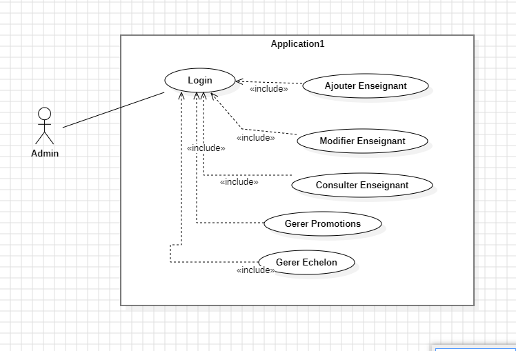{width="6.267716535433071in"
height="4.263888888888889in"}

[Fiche Descriptive de CU :]{.underline}

+-----------------------------------------------------------------------+
| Nom de CU : Ajouter Enseignant                                        |
+=======================================================================+
| Type :Primaire                                                        |
+-----------------------------------------------------------------------+
| Acteur : Admin                                                        |
+-----------------------------------------------------------------------+
| Objectif : Admin insérer nouvel enseignant                            |
+-----------------------------------------------------------------------+
| Précondition : L\'administrateur est authentifié et a les droits      |
| d\'ajout d\'un nouvel enseignant.                                     |
+-----------------------------------------------------------------------+
| Postcondition : Création d\' un enseignant                            |
+-----------------------------------------------------------------------+
| Déroulement :                                                         |
|                                                                       |
| Action en début                                                       |
|                                                                       |
| 1.  l\'administrateur accède à la page d\'accueil de l\'application.  |
|                                                                       |
| 2.  l\'administrateur clique sur le bouton Ajouter Enseignant pour    |
|     > accéder au formulaire d\'ajout d\'un nouvel enseignant.         |
|                                                                       |
| 3.  Le système affiche un formulaire vide avec les champs nécessaires |
|     > pour saisir les informations de l\'enseignant (matricule,nom,   |
|     > prénom,conjoint,Diplôme, etc.).                                 |
|                                                                       |
| 4.  L\'administrateur remplit les informations requises dans le       |
|     > formulaire et clique sur le bouton \"Valider\" pour soumettre   |
|     > les informations.                                               |
|                                                                       |
| 5.  Le système vérifie les données saisies et enregistre le nouvel    |
|     > enseignant dans la base de données.                             |
|                                                                       |
| 6.  Le système affiche un message de confirmation de l\'ajout réussi  |
|     > de l\'enseignant et fait une redirection au home Page.          |
+-----------------------------------------------------------------------+

[Notre Diagramme du Séquence:]{.underline}

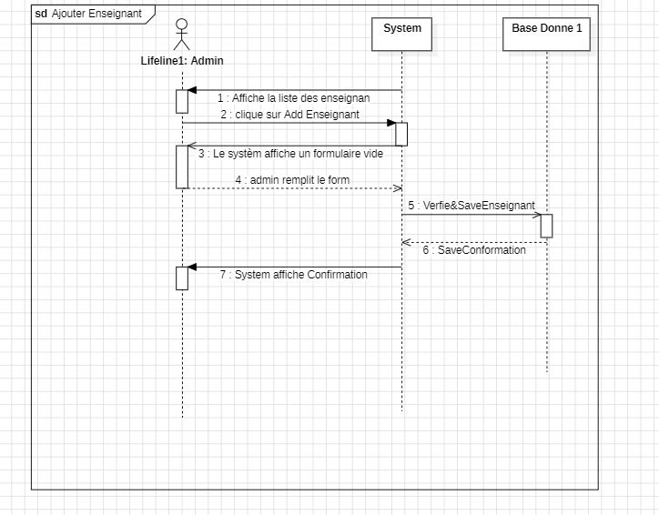{width="6.267716535433071in"
height="4.902777777777778in"}

[Fiche Descriptive de CU :]{.underline}

+-----------------------------------------------------------------------+
| Nom de CU : Modifier Enseignant                                       |
+=======================================================================+
| Type :Primaire                                                        |
+-----------------------------------------------------------------------+
| Acteur : Admin                                                        |
+-----------------------------------------------------------------------+
| Objectif : Admin modifier un existant enseignant                      |
+-----------------------------------------------------------------------+
| Précondition :L\'administrateur est authentifié et a les droits       |
| d\'ajout d\'un nouvel enseignant.                                     |
+-----------------------------------------------------------------------+
| Postcondition : Modification d'un enseignant                          |
+-----------------------------------------------------------------------+
| Déroulement :                                                         |
|                                                                       |
| Action en début                                                       |
|                                                                       |
| 1.  l\'administrateur accède à la page d\'accueil de l\'application.  |
|                                                                       |
| 2.  L\'administrateur sélectionne l\'enseignant dont il souhaite      |
|     > modifier les informations .                                     |
|                                                                       |
| 3.  Le système affiche la page de détails de l\'enseignant            |
|     > sélectionné, avec la possibilité de modification.               |
|                                                                       |
| 4.  L\'administrateur modifie les informations nécessaires de         |
|     > l\'enseignant (nom, prénom etc.)                                |
|                                                                       |
| 5.  clique sur le bouton \"Enregistrer\" ou équivalent.               |
|                                                                       |
| 6.  Le système vérifie les données modifiées et met à jour les        |
|     > informations de l\'enseignant dans la base de données.          |
|                                                                       |
| ```{=html}                                                            |
| <!-- -->                                                              |
| ```                                                                   |
| 7.  Le système affiche un message de confirmation de la modification  |
|     > réussie.                                                        |
+-----------------------------------------------------------------------+

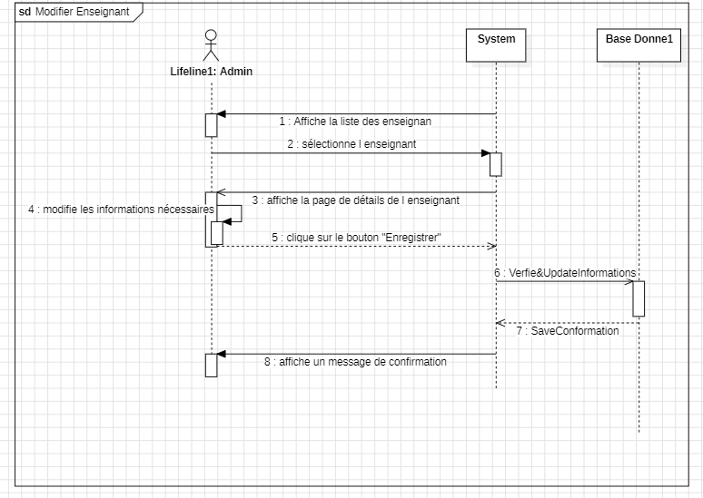{width="6.267716535433071in"
height="4.444444444444445in"}

+-----------------------------------------------------------------------+
| Nom de CU Gérer Promotion                                             |
+=======================================================================+
| Type :Primaire                                                        |
+-----------------------------------------------------------------------+
| Acteur : Admin                                                        |
+-----------------------------------------------------------------------+
| Objectif : Permettre à l\'administrateur de gérer les promotions des  |
| enseignants en mettant à jour les informations liées à la promotion.  |
+-----------------------------------------------------------------------+
| Précondition : L\'administrateur est authentifié et a les droits de   |
| gestion des promotions des enseignants.                               |
+-----------------------------------------------------------------------+
| Postcondition :                                                       |
+-----------------------------------------------------------------------+
| Déroulement :                                                         |
|                                                                       |
| Action en début                                                       |
|                                                                       |
| 1.  l\'administrateur accède à la page d\'accueil de l\'application,  |
|     > où la liste des enseignants est affichée.                       |
|                                                                       |
| 2.  L\'administrateur sélectionne l\'enseignant dont il souhaite      |
|     > gérer la promotion.                                             |
|                                                                       |
| 3.  Le système affiche la page de détails de l\'enseignant            |
|     > sélectionné, intégrant un formulaire permettant de ajouter la   |
|     > promotion. Le formulaire contient les informations suivantes :  |
|                                                                       |
| -   Date de promotion                                                 |
|                                                                       |
| -   Grade de promotion                                                |
|                                                                       |
| -   Diplôme obtenu lors de la promotion.                              |
|                                                                       |
| 4.  L\'administrateur remplit les informations de promotion           |
|     > directement dans ce formulaire et clique sur le bouton          |
|     > \"Enregistrer".                                                 |
|                                                                       |
| 5.  Le système vérifie les données saisies et met à jour les          |
|     > informations de promotion de l\'enseignant dans la base de      |
|     > données.                                                        |
|                                                                       |
| 6.  Le système affiche la promotion ajoutée dans la même page, avec   |
|     > un message de confirmation.                                     |
+-----------------------------------------------------------------------+

+-----------------------------------------------------------------------+
| Nom de CU : Gérer Échelon                                             |
+=======================================================================+
| Type :Primaire                                                        |
+-----------------------------------------------------------------------+
| Acteur : Admin                                                        |
+-----------------------------------------------------------------------+
| Objectif : Permettre à l\'administrateur de gérer les promotions des  |
| enseignants en mettant à jour les informations liées à la Echelon.    |
+-----------------------------------------------------------------------+
| Précondition : L\'administrateur est authentifié et a les droits de   |
| gestion des promotions des enseignants.                               |
+-----------------------------------------------------------------------+
| Postcondition :                                                       |
+-----------------------------------------------------------------------+
| Déroulement :                                                         |
|                                                                       |
| Action en début                                                       |
|                                                                       |
| 1.  l\'administrateur accède à la page d\'accueil de l\'application,  |
|     > où la liste des enseignants est affichée.                       |
|                                                                       |
| 2.  L\'administrateur sélectionne l\'enseignant dont il souhaite      |
|     > gérer la promotion à Echelon.                                   |
|                                                                       |
| ```{=html}                                                            |
| <!-- -->                                                              |
| ```                                                                   |
| 7.  Le système affiche la page de détails de l\'enseignant            |
|     > sélectionné, intégrant un formulaire permettant d\' ajouter la  |
|     > promotion en échelon . Le formulaire contient les informations  |
|     > suivantes :                                                     |
|                                                                       |
| -   Date de promotion en échelon                                      |
|                                                                       |
| -   Nombre d\'échelons à promouvoir                                   |
|                                                                       |
| 8.  L\'administrateur remplit les informations de promotion en        |
|     > échelon directement dans ce formulaire et clique sur le bouton  |
|     > \"Enregistrer".                                                 |
|                                                                       |
| 9.  Le système vérifie les données saisies et met à jour les          |
|     > informations de promotion en échelon de l\'enseignant dans la   |
|     > base de données.                                                |
|                                                                       |
| 10. Le système affiche l' Échelon ajoutée dans la même page, avec un  |
|     > message de confirmation.                                        |
+-----------------------------------------------------------------------+

Le diagramme de séquence pour la gestion de la promotion en échelon suit
un schéma similaire à celui de la promotion en grade :

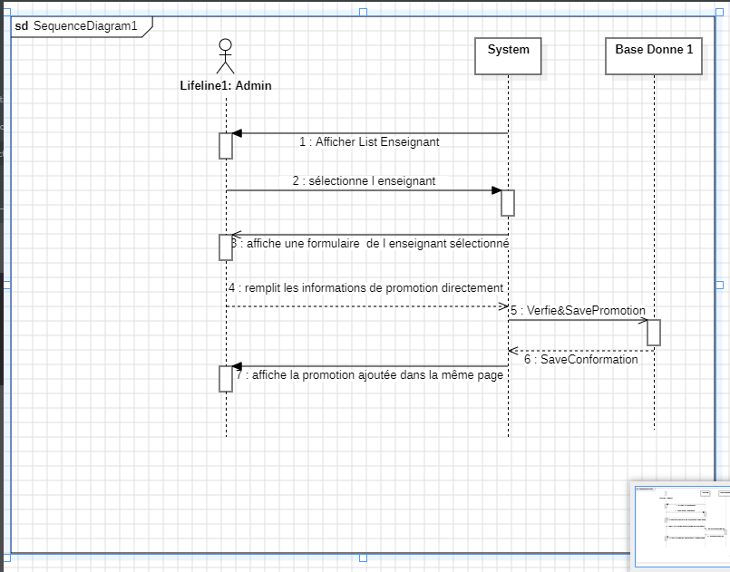{width="6.267716535433071in"
height="4.916666666666667in"}

[Notre Diagramme du Class :]{.underline}

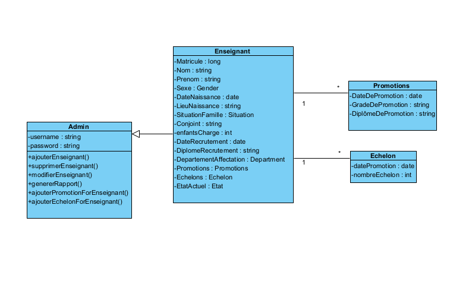{width="7.244792213473316in"
height="4.416666666666667in"}

**[Partie 2 :]{.underline}**

[Application 2 :]{.underline}

Cette application est dédiée au service de recherche de la Faculté, et
elle maintient à jour la carrière de recherche des Enseignants.

[Exigences Funcional :]{.underline}

-   Un Acteur Admin doit permettre [l\'ajout]{.mark} d\'un nouvel
    > enseignant avec toutes les informations pertinentes,

y compris le matricule, le nom, le prénom ... etc .

-   L\'administrateur doit avoir la capacité de [consulter]{.mark} le
    > [dossier complet]{.mark} d\'un enseignant en utilisant le
    > matricule.

-   L'admin doit avoir la capacité [de mettre à jour]{.mark} les
    > informations d\'un enseignant existant.

-   L\'administrateur doit avoir la capacité [d\'enregistrer]{.mark} de
    > nouvelles promotions en grades de [recherche]{.mark} pour un
    > enseignant, en spécifiant la date de promotion, le nouveau grade,
    > et le diplôme associé.

-   L\'administrateur doit pouvoir mettre à jour les promotions en
    > grades de recherche d\'un enseignant, en spécifiant la date de
    > promotion et le nouveau grade.

[Notre Diagramme de Use Case :]{.underline}

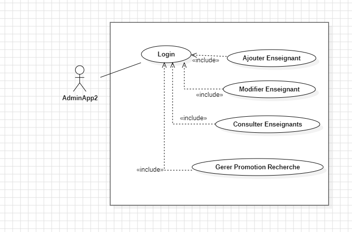{width="6.267716535433071in"
height="4.138888888888889in"}

La description du cas d\'utilisation (CU) et le diagramme de séquence
sont pratiquement identiques à ceux de l\'Application 1.

[Notre Diagramme du Class :]{.underline}

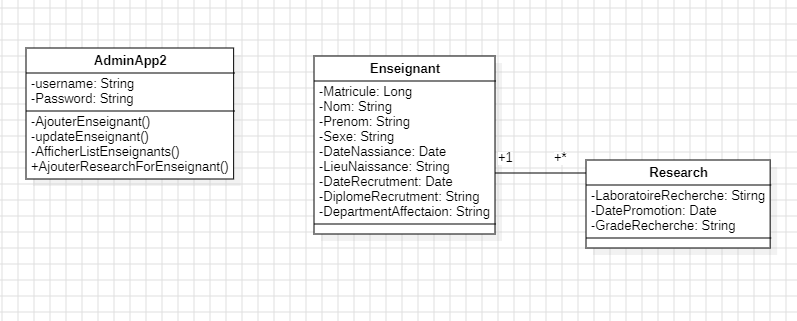{width="6.267716535433071in"
height="2.5277777777777777in"}

[Technologie :]{.underline}

-   le langage JAVA J2EE sous la plateforme ECLIPSE

-   SGBD Serveur POSTGRESQL 16.

-   L'outil AXIS2 1.6.2.

-   Le serveur d'application APACHE TOMCAT v 8.5.

[Description :]{.underline}

-   Application 1 =\> Java 17 + [Database 1.]{.mark}

-   Application 2 =\> Java 17 + [Database 2.]{.mark}

-   Application 3 **server** (Application 1 + l'Ajoute de web service )
    > =\> Java 17 + no Database (Database 1) .

-   Application 4 **client** (Application 2 + Modification )

> =\> **Java 1.7** + Axis2 1.6.2 + [Database 3.]{.mark}

[Quelque Images pour l'application :]{.underline}

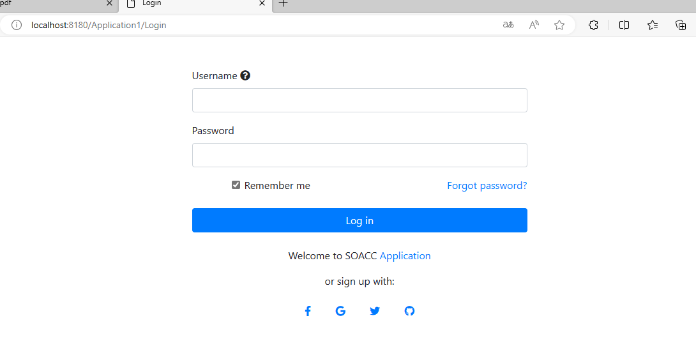{width="6.244792213473316in"
height="3.1979166666666665in"}

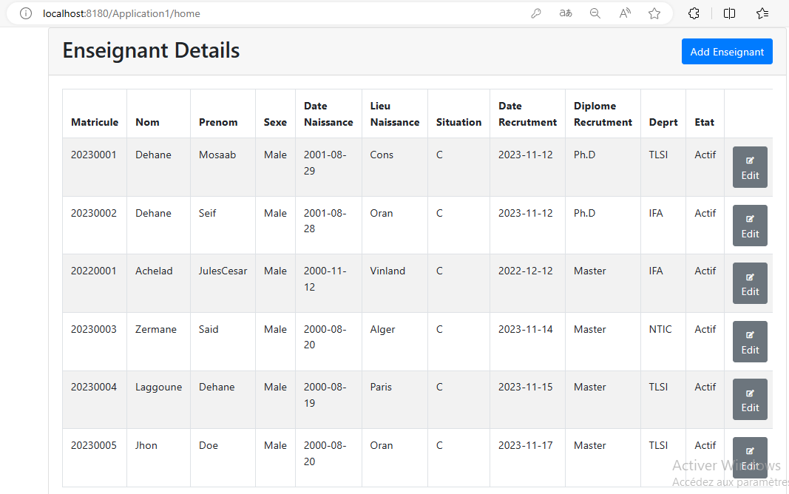{width="6.088542213473316in"
height="3.5416666666666665in"}

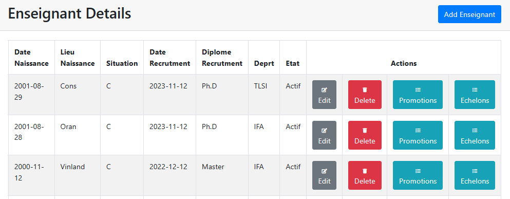{width="6.267716535433071in"
height="2.4444444444444446in"}

**[Partie 3 :]{.underline}**

[Application 1 :]{.underline}

Cette application, conçue comme un serveur de service web SOAP, permet
de gérer et maintenir à jour le dossier administratif de la carrière des
Enseignants. En utilisant les principes du web service SOAP, elle
facilite la communication et l\'échange de données avec d\'autres
applications

(Application 2 ) .

[Création d\'un Service Web SOAP depuis l\'Application 1:]{.underline}

1.  Ajouter Axis2 1.6.2 dans notre Project Eclipse et dans le serveur
    > Tomcat.

2.  Créer une Service Class including this opérations "Get
    > EnseignantByMatricule(Long matricule)" & "GetAllEnseignants()".

> 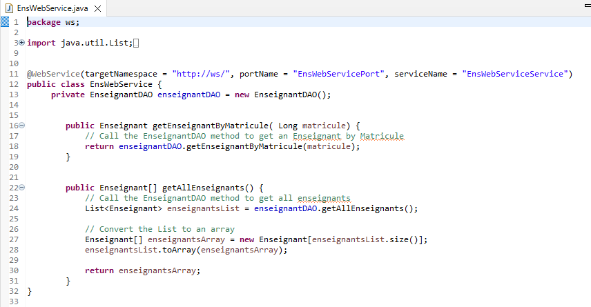{width="6.267716535433071in"
> height="3.263888888888889in"}
>
> La classe EnseignantService est annotée avec \@WebService pour
> indiquer qu\'il s\'agit d\'une classe de service web.
>
> La méthode getEnseignantByMatricule prend un matricule en tant que
> paramètre et renvoie l\'objet Enseignant correspondant à partir de la
> base de données simulée.
>
> La méthode getAllEnseignants renvoie une liste de tous les enseignants
> dans la base de données simulée.

3.  Créer un Web Service dans Eclipse Using Axis 2& deploy it in Tomcat
    > 8.5 .

4.  Générer un fichier WSDL à partir de notre classe de service(using
    > Axis2).

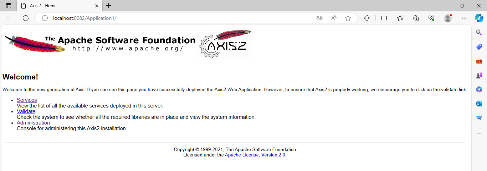{width="6.267716535433071in"
height="2.2083333333333335in"}

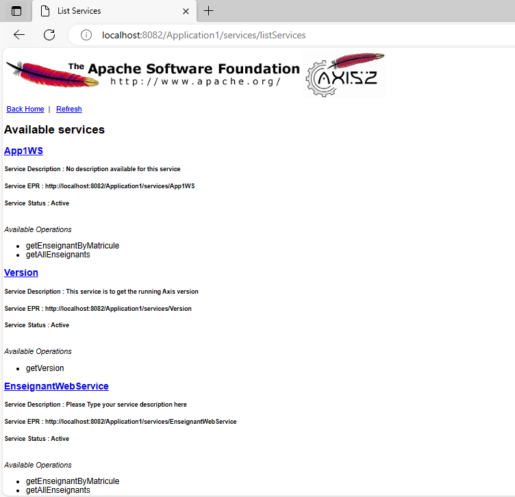{width="4.505208880139983in"
height="4.341557305336833in"}

Le Fichier WSDL :

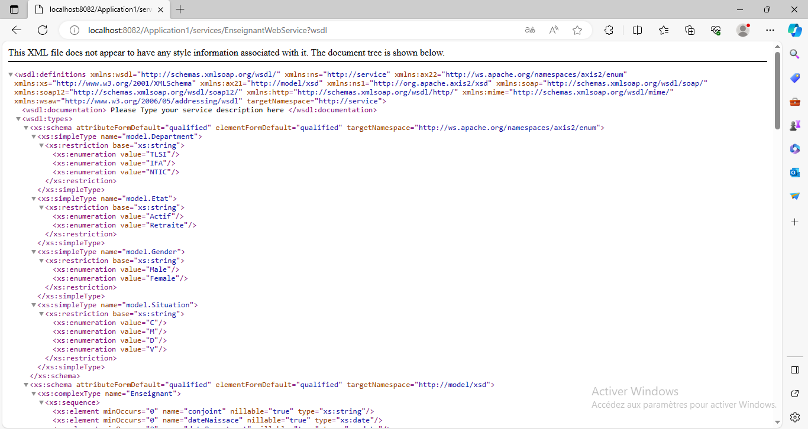{width="6.267716535433071in"
height="3.3333333333333335in"}

**[Partie 4 :]{.underline}**

[Application 4 client (Application 2 + Modification):]{.underline}

Cette application, également conçue comme un service web SOAP, est
dédiée au service de recherche de la Faculté, et elle maintient à jour
la carrière de recherche des Enseignants. Elle exploite les données
administratives fournies par l\'Application 1 et les utilise pour suivre
les promotions en grades spécifiques à la recherche.

[Exigences Funcional :]{.underline}

-   L\'administrateur doit avoir la capacité de [consulter]{.mark} le
    > [dossier complet]{.mark} d\'un enseignant en utilisant le
    > matricule, en se basant sur les données administratives fournies
    > par l\'Application 1.

-   L\'administrateur doit avoir la capacité [d\'enregistrer]{.mark} de
    > nouvelles promotions en grades de [recherche]{.mark} pour un
    > enseignant, en spécifiant la date de promotion, le nouveau grade,
    > et le diplôme associé.

-   L\'administrateur doit pouvoir mettre à jour les promotions en
    > grades de recherche d\'un enseignant, en spécifiant la date de
    > promotion et le nouveau grade.

-   L\'utilisation de l\'architecture de web service SOAP est
    > recommandée pour permettre une intégration efficace et éviter la
    > double mise à jour des informations, minimisant ainsi le taux
    > d\'erreurs.

[Notre Diagramme de Use Case :]{.underline}

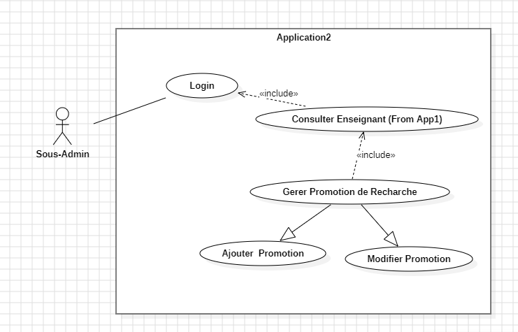{width="6.267716535433071in"
height="4.013888888888889in"}

+-----------------------------------------------------------------------+
| Nom de CU Gérer Promotion de Recherche                                |
+=======================================================================+
| Type :Primaire                                                        |
+-----------------------------------------------------------------------+
| Acteur : Sous-Admin ayant les droits nécessaires pour gérer les       |
| promotions en grades de recherche dans l\'Application 2.              |
+-----------------------------------------------------------------------+
| Objectif : Permet à l\'administrateur d\'Application 2 de gérer les   |
| promotions en grades de recherche des enseignants, en incluant        |
| l\'ajout, la consultation, la modification des promotions             |
+-----------------------------------------------------------------------+
| Précondition : L\'administrateur est authentifié et a les droits de   |
| gestion des promotions en recherche.                                  |
+-----------------------------------------------------------------------+
| Postcondition :                                                       |
+-----------------------------------------------------------------------+
| Déroulement :                                                         |
|                                                                       |
| Action en début                                                       |
|                                                                       |
| 1.  Une fois connecté, l\'administrateur accède à la page de list des |
|     > Enseignants (From application 1).                               |
|                                                                       |
| 2.  L\'administrateur sélectionne l\'enseignant dont il souhaite      |
|     > gérer la promotion en recherche.                                |
|                                                                       |
| 3.  L\'administrateur a le choix entre les actions suivantes :        |
|                                                                       |
| -   Ajouter une nouvelle promotion en recherche en spécifiant la date |
|     > de promotion, le nouveau grade de recherche, et le diplôme      |
|     > associé.                                                        |
|                                                                       |
| -   Consulter les détails d\'une promotion en recherche existante.    |
|                                                                       |
| -   Modifier les informations d\'une promotion en recherche           |
|     > existante.                                                      |
|                                                                       |
| 4.  Après chaque action, le système met à jour les informations dans  |
|     > la base de données de l\'Application 2.                         |
+-----------------------------------------------------------------------+

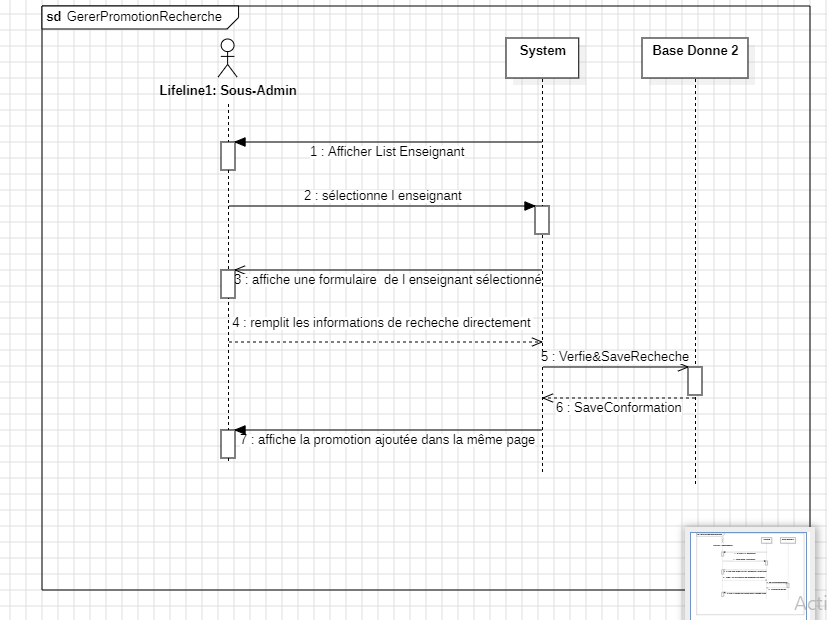{width="6.267716535433071in"
height="4.694444444444445in"}

[Diagramme du Classe :]{.underline}

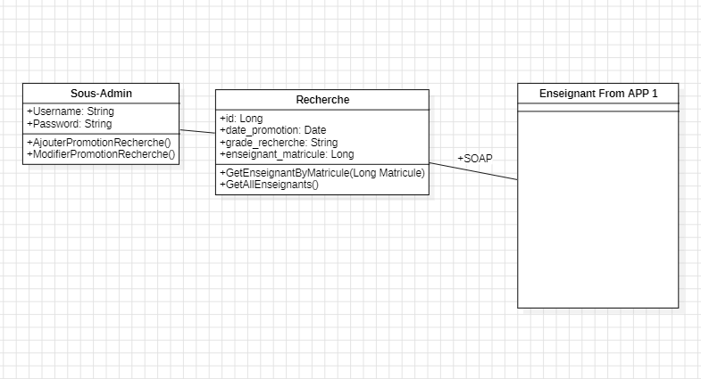{width="6.267716535433071in"
height="3.388888888888889in"}

[Étapes pour le Client Web SOAP (Côté Client - Application 2)
:]{.underline}

1.  Générer des classes de client à partir du WSDL :

Using Eclipse Web Service Client

2.  Utiliser les classes générées dans le client :

> EnseignantServiceStub

3.  Appel de la méthode getEnseignantByMatricule

> GetEnseignantByMatriculeRequest
>
> GetEnseignantByMatriculeResponse.

4\. Exécuter le client .
