# Web Service SOAP with Axis2 Between 2 Applications

## Partie 1:

### Application 1:

This application manages and updates the administrative files of teachers (Human Resources Management).

#### Functional Requirements:

- An Admin should be able to add a new teacher with all relevant information, including matriculation, name, and more.
- The admin should be able to view the complete file of a teacher using their matriculation.
- The admin must be able to update the information of an existing teacher, including promotions in grades and echelons.
- The admin should record promotions in grades, including the promotion date, new grade, and associated diploma.
- The admin must be able to record promotions in echelons, specifying the promotion date and the number of echelons.

#### Use Case Diagram:

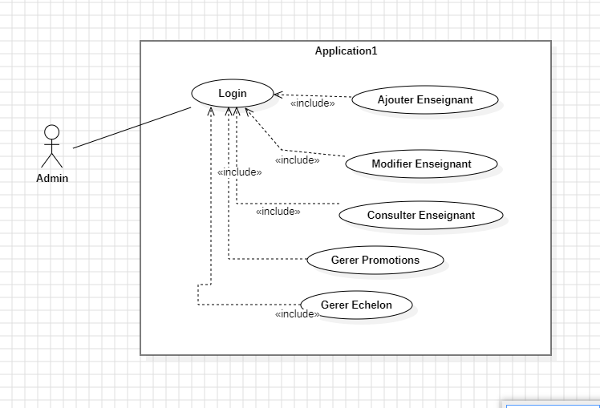

#### Use Case Description:

**Add Teacher:**
- Type: Primary
- Actor: Admin
- Objective: Admin inserts a new teacher.
- Preconditions: The administrator is authenticated and has the rights to add a new teacher.
- Postcondition: Creation of a new teacher.
- Steps:
  1. The administrator accesses the application's homepage.
  2. Clicks on the "Add Teacher" button to access the new teacher addition form.
  3. The system displays an empty form with necessary fields for teacher information.
  4. The administrator fills in the required information and clicks "Validate" to submit.
  5. The system verifies the entered data and saves the new teacher in the database.
  6. The system displays a confirmation message and redirects to the homepage.

**Modify Teacher:**
- Type: Primary
- Actor: Admin
- Objective: Admin modifies an existing teacher.
- Preconditions: The administrator is authenticated and has the rights to add a new teacher.
- Postcondition: Modification of an existing teacher.
- Steps:
  1. The administrator accesses the application's homepage.
  2. Selects the teacher to modify.
  3. The system displays the selected teacher's details page with modification options.
  4. The administrator modifies the necessary information (name, etc.).
  5. Clicks on the "Save" button or equivalent.
  6. The system verifies the modified data and updates the teacher's information in the database.
  7. The system displays a successful modification confirmation message.

**Manage Promotion:**
- Type: Primary
- Actor: Admin
- Objective: Allow the administrator to manage promotions by updating promotion information.
- Preconditions: The administrator is authenticated and has the rights to manage teacher promotions.
- Postcondition: Updated promotion information.
- Steps:
  1. The administrator accesses the application's homepage.
  2. Selects the teacher for promotion management.
  3. The system displays the selected teacher's details page with a form to add promotions.
  4. The administrator fills in promotion information in the form and clicks "Save."
  5. The system verifies the entered data and updates the teacher's promotion information in the database.
  6. The system displays the added promotion on the same page with a confirmation message.

**Manage Echelon:**
- Type: Primary
- Actor: Admin
- Objective: Allow the administrator to manage promotions by updating echelon information.
- Preconditions: The administrator is authenticated and has the rights to manage teacher promotions.
- Postcondition: Updated echelon information.
- Steps:
  1. The administrator accesses the application's homepage.
  2. Selects the teacher for echelon promotion management.
  3. The system displays the selected teacher's details page with a form to add echelon promotions.
  4. The administrator fills in echelon promotion information in the form and clicks "Save."
  5. The system verifies the entered data and updates the teacher's echelon promotion information in the database.
  6. The system displays the added echelon promotion on the same page with a confirmation message.

#### Sequence Diagram:

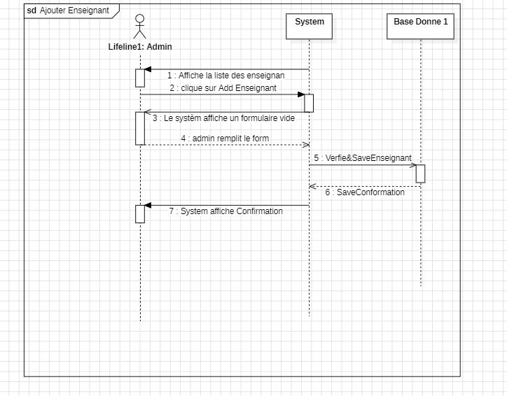
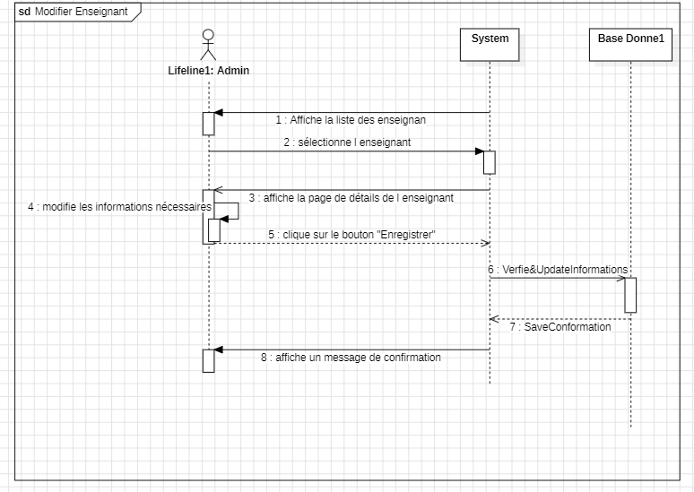
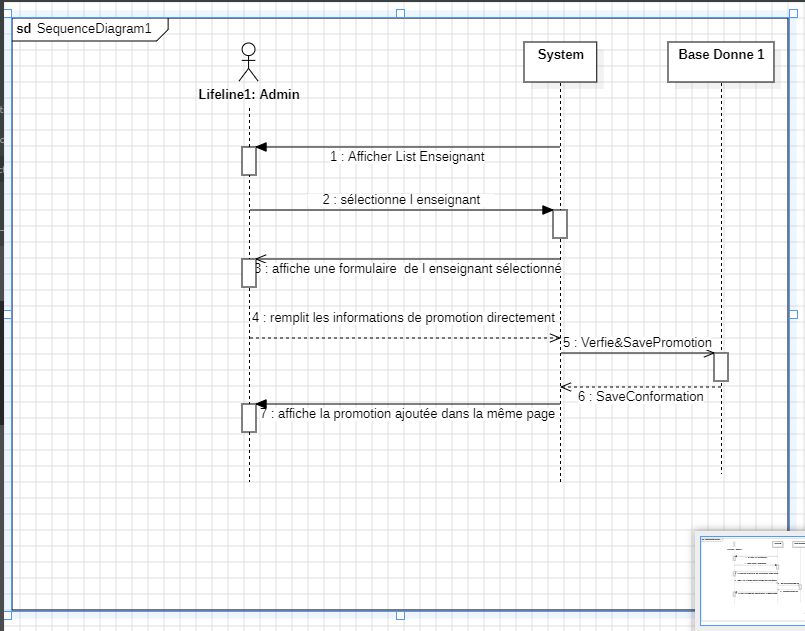

#### Class Diagram:

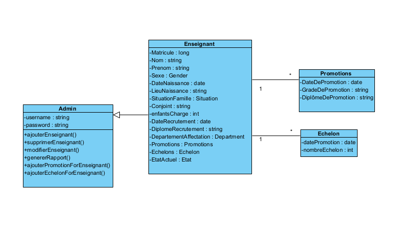

### Application 2:

This application is dedicated to the Faculty's research service, maintaining and updating the research careers of teachers.

#### Functional Requirements:

- An Admin should be able to add a new teacher with all relevant information, including matriculation, name, and more.
- The admin should be able to view the complete file of a teacher using their matriculation.
- The admin must be able to update the information of an existing teacher.
- The admin should record promotions in research grades for a teacher, specifying the promotion date, new grade, and associated diploma.
- The admin should be able to update promotions in research grades for a teacher, specifying the promotion date and the new grade.

#### Use Case Diagram:

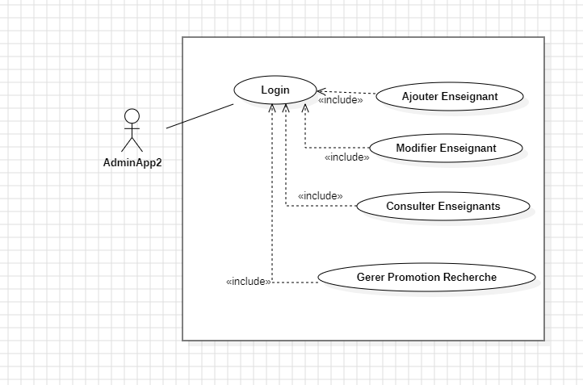

#### Class Diagram:

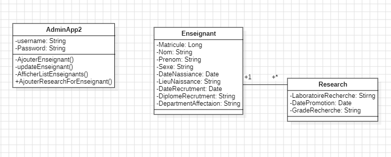

#### Technology:

- Language: Java 1.7  & Java 17 
- Framework: Axis2 1.6.2
- Database: Postgres 16

#### Images:

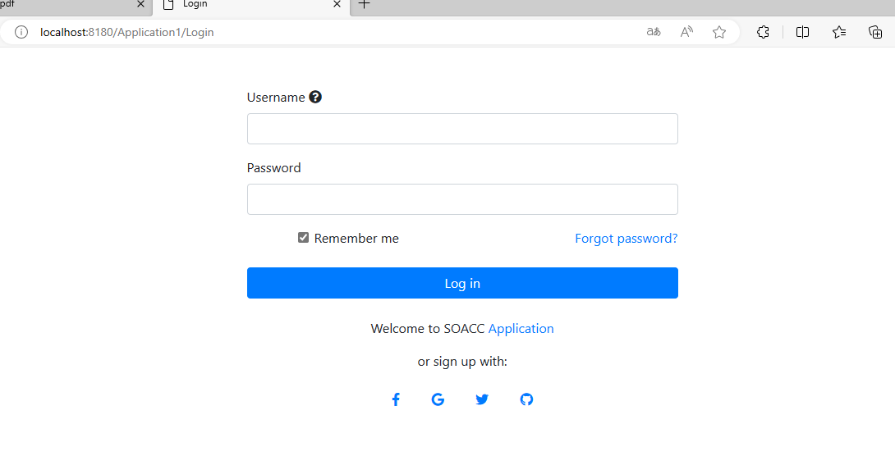
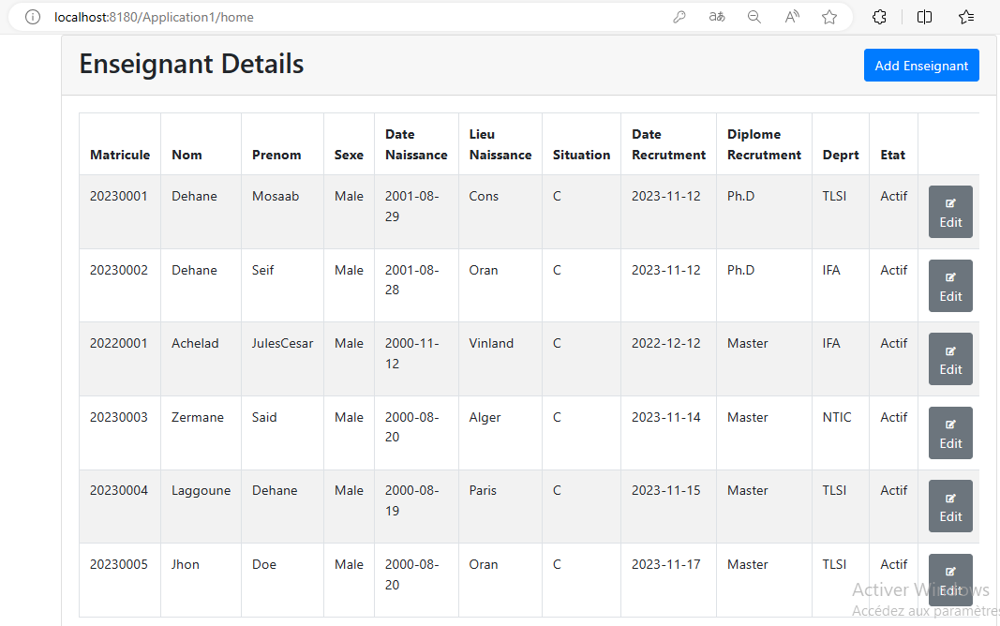
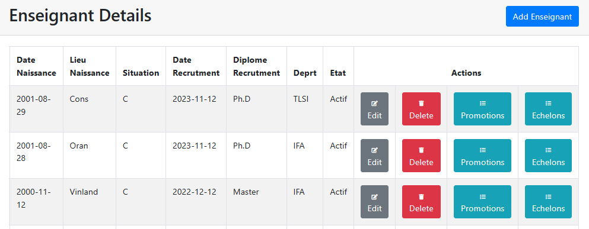

## Partie 3:

### Application 3 (Server):

This application, designed as a SOAP web service server, manages and updates the administrative files of teachers. It facilitates communication and data exchange with other applications, including Application 4.

#### Creating a SOAP Web Service from Application 1:

1. Add Axis2 1.6.2 to the Eclipse project and Tomcat server.
2. Create a Service Class with operations: "GetEnseignantByMatricule(Long matricule)" and "GetAllEnseignants()."
3. Create a Web Service in Eclipse using Axis2 and deploy it in Tomcat 8.5.
4. Generate a WSDL file from the service class using Axis2.

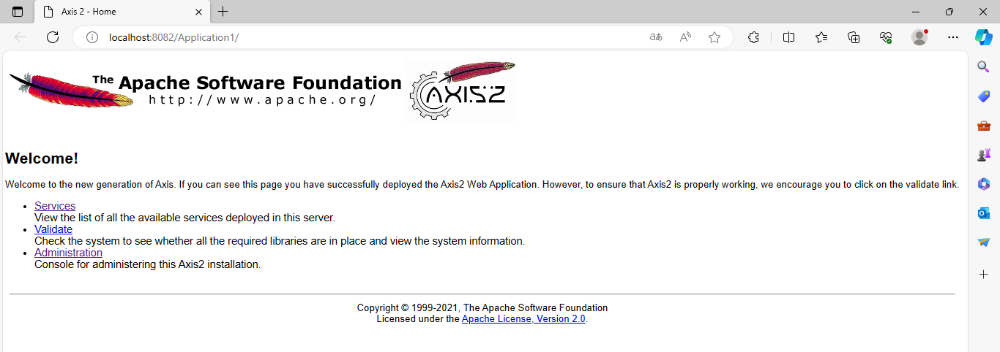

## Partie 4:

### Application 4 (Client):

This application, also designed as a SOAP web service, is dedicated to the Faculty's research service. It uses administrative data provided by Application 1 to track promotions in grades specific to research.

#### Functional Requirements:

- The admin must be able to view the complete file of a teacher using their matriculation, based on the data provided by Application 1.
- The admin should be able to record new promotions in research grades for a teacher, specifying the promotion date, new grade, and associated diploma.
- The admin should be able to update promotions in research grades for a teacher, specifying the promotion date and the new grade.

#### Use Case Diagram:

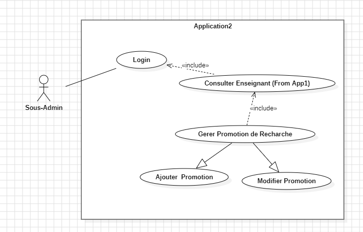

#### Class Diagram:

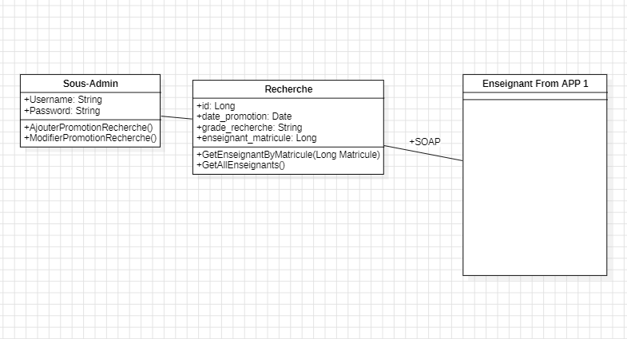

#### Steps for SOAP Web Client (Client Side - Application 2):

1. Generate client classes from the WSDL using Eclipse Web Service Client.
2. Use the generated classes in the client: EnseignantServiceStub.
3. Call the getEnseignantByMatricule method using GetEnseignantByMatriculeRequest and GetEnseignantByMatriculeResponse.
4. Execute the client.

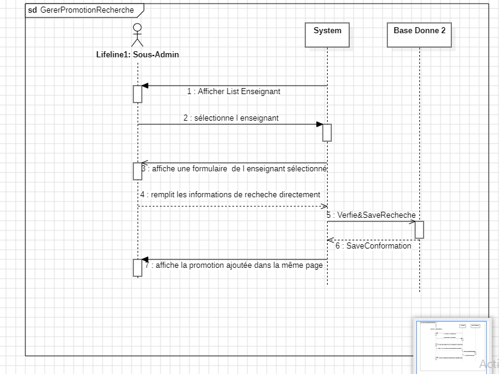

### Class Diagram:

